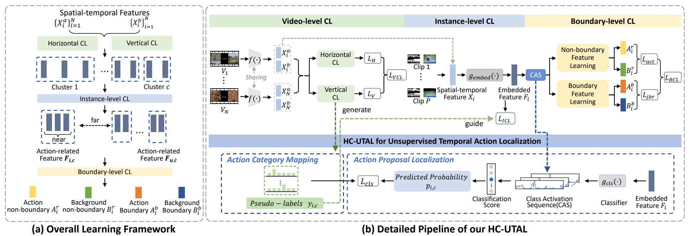
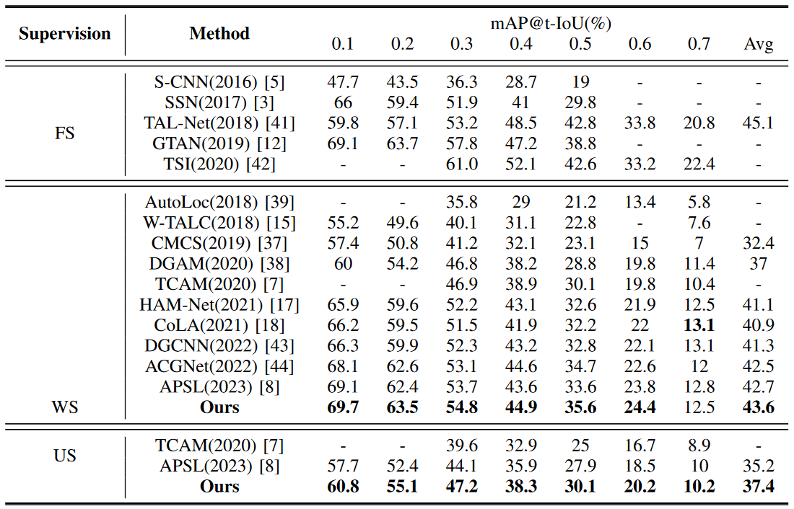
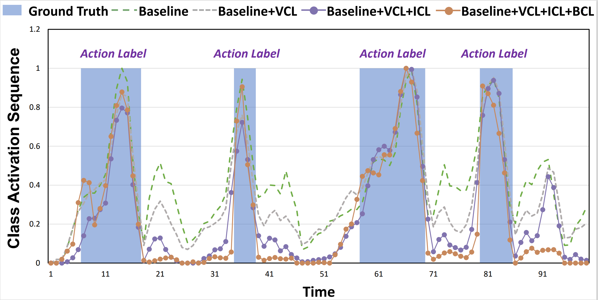
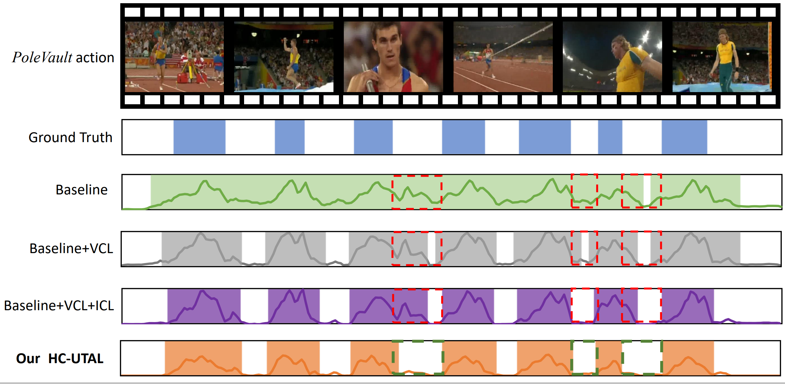
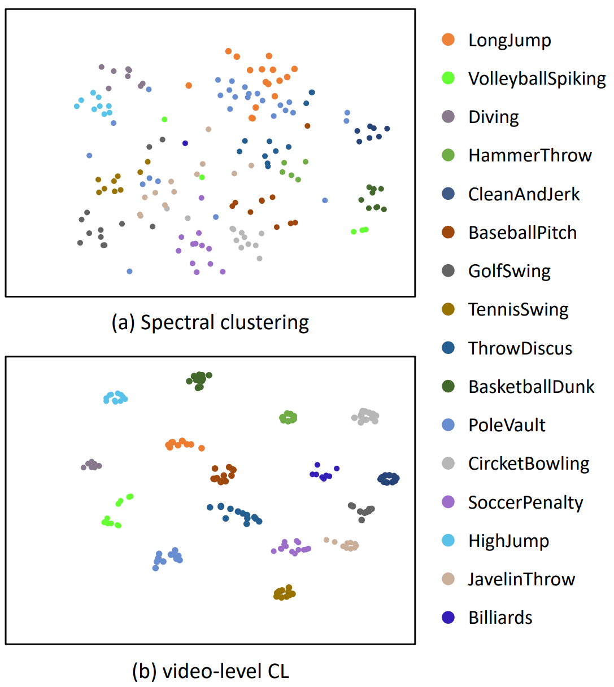

# HC-UTAL

 

We propose an end-to-end Hierarchical Contrastive UTAL framework with high-coupling feature learning, called HC-UTAL. HC-UTAL incorporates coarse-to-fine contrastive learning (CL) at three levels:  video level, instance level, and boundary level, thus obtaining robust UTAL performance.  

## Results

Comparison of state-of-the-art methods on the THUMOS'14 dataset in fully supervised, weakly supervised, and unsupervised learning settings, respectively. We denote the fully supervised, weakly supervised, and unsupervised as FS, WS, and US, respectively. The best results are in bold.



## Dependencies

- python 3.7.9
- pytorch 1.7.1
- cuda 11.6
- cudnn 8.5.0

## Test
Test the HC_UTAL model by run

```bash
python test.py
```

## Train
Train the HC_UTAL model by run

```bash
python main.py
```

## Models

Due to space limitations, model files cannot be transferred. We provide a [link](https://pan.baidu.com/s/1Zd7NjpreM0eTKeTtajHvKQ?pwd=skts ) to download them by clicking on it.

## Features

The feature files of the THUMOS'14 dataset are placed [here](https://pan.baidu.com/s/1C4060pUX9GgeZOdNFQo8yg?pwd=pinh ). After downloading, place them in the data/THUMOS14 directory.


## Visualization
The class activation sequence visualization results are as follows:


The localization visualization results are as follows:


The clustering visualization results are as follows:



